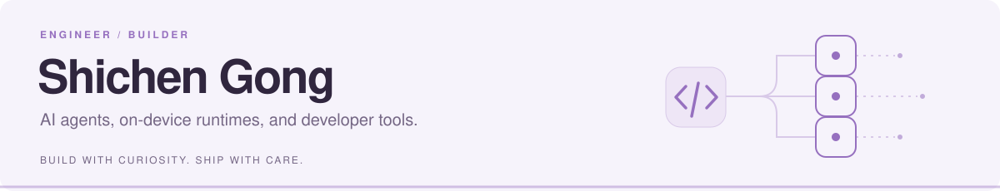

<picture>
  <source media="(prefers-color-scheme: dark)" srcset="./header-dark.svg">
  
</picture>

I build tools that bring AI into everyday development — from terminal agents to on-device runtimes.

**Work** &nbsp; Wireless Development Engineer @ **Taobao & Tmall Group**  
**Education** &nbsp; B.Eng., **Chongqing University**

**Working with** &nbsp; `Go` · `Java` · `Swift` · `Objective-C` · `TypeScript` · `C/C++`

<picture>
  <source media="(prefers-color-scheme: dark)" srcset="https://raw.githubusercontent.com/GongShichen/GongShichen/output/snake-dark.svg">
  
</picture>

Explore my selected projects below ↓
